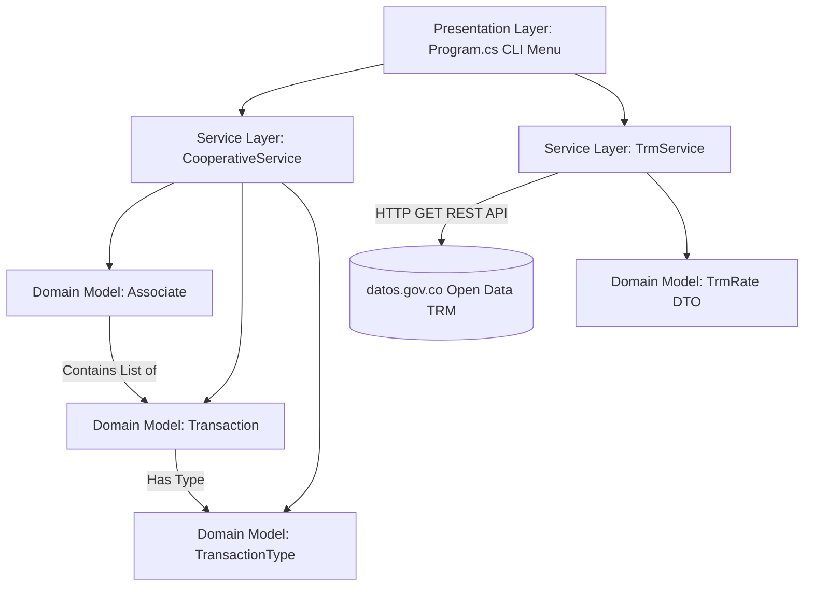

# Cooperativa Financiera El Progreso - Financial Management System

[](https://dotnet.microsoft.com/)
[](https://learn.microsoft.com/en-us/dotnet/csharp/)
[](https://github.com/)

A console-based financial management and teller desk system designed for **Cooperativa Financiera El Progreso**. The application manages cooperative associates, handles financial transactions (deposits and withdrawals) with automatic cash-handling fee calculations, connects to external government financial services for real-time exchange rates (TRM), and generates comprehensive management reports.

---

## Table of Contents

1. [Project Description](#project-description)
2. [Key Features](#key-features)
3. [System Architecture](#system-architecture)
4. [Technologies Used](#technologies-used)
5. [Project Structure](#project-structure)
6. [Getting Started & Execution Instructions](#getting-started--execution-instructions)
7. [System Menu & User Guide](#system-menu--user-guide)
8. [Technical Decisions & Design Rationale](#technical-decisions--design-rationale)

---

## Project Description

**Cooperativa Financiera El Progreso** is a console application developed in C# on .NET 10. It serves as a financial management terminal for cooperative cashiers and administrators. 

The application facilitates:
- Full lifecycle management of cooperative associates (registration, query, update, and deletion under strict domain constraints).
- Real-time transaction processing with balance enforcement and automated operational surcharge rules.
- Live exchange rate queries via the Colombian Open Data Socrata REST API (*Superintendencia Financiera de Colombia*) to convert account balances between Colombian Pesos (COP) and US Dollars (USD).
- Analytical and executive reporting tools for business decision-making and cash flow monitoring.

---

## Key Features

### 1. Associate Management (CRUD)
- **Registration:** Register new associates with unique Document ID, Full Name, Phone Number, and Address. Initial balance starts at `$0 COP`.
- **Directory Listing:** Formatted tabular view of all registered associates and current balances.
- **Search Capabilities:** Search associates by exact Document ID or partial Name search.
- **Update Information:** Safely update contact details (Name, Phone, Address) preserving existing transaction logs.
- **Protected Deletion:** Deletion is strictly prevented if the associate has an existing balance or transaction history, protecting financial audit integrity.

### 2. Transaction Processing
- **Deposits (Consignaciones):** Credit funds to associate accounts with positive amount verification.
- **Withdrawals (Retiros):** Debit funds with automated fee rules:
  - Withdrawals exceeding **$1,000,000 COP** automatically incur an **$8,000 COP** cash handling fee.
  - Overdraft protection validates that account balance covers `Amount + Fee`.
- **Transaction History:** Detailed chronological statement per associate displaying date, transaction type, base amount, applied fee, and final calculated balance.

### 3. Live TRM Integration & Currency Conversion
- Connects asynchronously to the official Colombian Open Data API (`datos.gov.co` / *Superintendencia Financiera*).
- Fetches the latest Representative Market Exchange Rate (TRM - *Tasa Representativa del Mercado*).
- Computes real-time balance in USD with valid exchange date ranges.
- Features resilient fail-safe error handling so network outages do not compromise application execution.

### 4. Executive & Management Reports (Informes de Gerencia)
1. **Total Liquidity & Average Balance:** Cooperative total available funds, member count, and average balance per member.
2. **Top 5 Associates:** Highest balance holders ranked in descending order.
3. **Dormant Associates:** Identification of registered members with zero transaction activity.
4. **Period Analytics:** Total deposits, withdrawals, transaction counts, and net cash flow within a custom date range (`yyyy-MM-dd`).
5. **Top 10 Largest Transactions:** Highest value movements executed across the entire cooperative.
6. **Associate Cash Flow Activity:** Comprehensive activity breakdown by associate (movement count, total deposited, total withdrawn, current balance).

---

## System Architecture

The application adopts a modular, layered architecture adhering to **Clean Architecture** and **Single Responsibility Principle (SRP)** principles:



### Layer Breakdown

1. **Presentation Layer (`Program.cs`):**
   - Handles the interactive command-line interface (CLI).
   - Manages user input reading, error presentation with colored console outputs (`ConsoleColor`), table formatting, and flow control.

2. **Service Layer (`Services/`):**
   - **`CooperativeService`**: Encapsulates all domain and business rules (balance verification, fee calculation, associate validations, and LINQ aggregations for executive reporting).
   - **`TrmService`**: Manages external HTTP communications via `HttpClient`, handling asynchronous calls and JSON deserialization into typed DTOs.

3. **Domain & Data Model Layer (`Models/`):**
   - **`Associate`**: Entity representing a member, containing associate metadata and their list of transactions, dynamically calculating their balance (`GetBalance()`).
   - **`Transaction`**: Entity representing monetary credits and debits with GUID identifiers, amounts, fees, and timestamps.
   - **`TransactionType`**: Enum defining transaction categories (`Deposit`, `Withdrawal`).
   - **`TrmRate`**: Data Transfer Object (DTO) with custom JSON mappings (`[JsonPropertyName]`) and invariant decimal parsing.

---

## Technologies Used

- **Runtime & Framework:** [.NET 10.0 SDK](https://dotnet.microsoft.com/)
- **Programming Language:** [C# 13](https://learn.microsoft.com/en-us/dotnet/csharp/)
- **HTTP Client & Networking:** `System.Net.Http.HttpClient`
- **JSON Serialization:** `System.Text.Json` (with `System.Text.Json.Serialization`)
- **Query & Data Processing:** LINQ (Language Integrated Query)
- **External API:** [Socrata Open Data API - Superintendencia Financiera de Colombia (TRM)](https://www.datos.gov.co/resource/32sa-8pi3.json)
- **Development Environment:** JetBrains Rider / .NET CLI

---

## Project Structure

```text
pruebadedesempeño/
├── Models/
│   ├── Associate.cs          # Associate entity and balance calculation
│   ├── Transaction.cs        # Transaction record entity with GUID & fee logic
│   ├── TransactionType.cs    # Deposit & Withdrawal enum definitions
│   └── TrmRate.cs            # TRM API response DTO with invariant parsing
├── Services/
│   ├── CooperativeService.cs # Core business logic, validations, & reporting
│   └── TrmService.cs         # Asynchronous HTTP consumer for official TRM
├── Program.cs                # Console user interface and application entrypoint
├── Readme.md                 # Project documentation
└── pruebadedesempeño.csproj  # .NET project configuration
```

---

## Getting Started & Execution Instructions

### Prerequisites

Ensure you have the [.NET 10.0 SDK](https://dotnet.microsoft.com/download) installed on your system.

To verify your installation, run:
```bash
dotnet --version
```

### Installation and Execution

1. **Navigate to the project root directory:**
   ```bash
   cd /home/cohorte5/pruebadedesempeño
   ```

2. **Restore dependencies and build the project:**
   ```bash
   dotnet build
   ```

3. **Run the application:**
   ```bash
   dotnet run
   ```

---

## System Menu & User Guide

When executed, the system displays the main interactive teller menu:

```text
==================================================
    COOPERATIVA FINANCIERA EL PROGRESO - CAJA     
==================================================
1.  Registrar un asociado nuevo
2.  Listar todos los asociados
3.  Buscar asociado por documento
4.  Buscar asociado por nombre
5.  Actualizar datos de un asociado
6.  Eliminar un asociado
7.  Consultar saldo en COP
8.  Consultar saldo en USD (TRM oficial)
9.  Registrar consignación
10. Registrar retiro
11. Ver movimientos de un asociado
12. Informes de gerencia
0.  Salir
==================================================
```

### Key Workflows

- **Deposit Funds (Option 9):** Enter Document ID and positive amount. Balance updates immediately.
- **Withdraw Funds (Option 10):** Enter Document ID and amount. If amount > $1,000,000 COP, the $8,000 fee is displayed and deducted from the balance. If funds are insufficient, transaction is rejected with descriptive message.
- **USD TRM Inquiry (Option 8):** Connects to the government TRM web service, displays current official exchange rate and valid date range, and computes equivalent balance in USD.
- **Management Reports (Option 12):** Accesses sub-menu with 6 executive reports (liquidity, top associates, dormant accounts, date-filtered flow, largest transactions, and cash flow ranking).

---

## Technical Decisions & Design Rationale

1. **Calculated Balance vs. Stored State:**
   - Account balance is computed on-the-fly via `Associate.GetBalance()` (`Sum(Deposits) - Sum(Withdrawals + Fees)`).
   - *Rationale:* Eliminates data synchronization discrepancies between stored balance fields and transaction ledgers, ensuring audit consistency.

2. **Audit Trail Protection in Entity Deletion:**
   - Associates who possess transaction history or active non-zero balances cannot be removed (`DeleteAssociate`).
   - *Rationale:* Prevents orphaned transactions or loss of historical financial ledger records.

3. **High-Precision Financial Arithmetic:**
   - All financial amounts, fees, and exchange rates utilize the `decimal` data type instead of `double` or `float`.
   - *Rationale:* Avoids binary floating-point rounding errors inherent to financial calculations.

4. **Resilient TRM Web Service Client:**
   - `TrmService` uses `HttpClient` with `try-catch` exception handling and null-safe DTO parsing.
   - *Rationale:* Network timeouts, DNS issues, or external API failures degrade gracefully without crashing the core teller operations.

5. **Culture-Invariant Parsing:**
   - Numerical parsing of TRM API responses uses `CultureInfo.InvariantCulture` and explicit string-to-decimal parsing.
   - *Rationale:* Ensures reliable parsing across different OS locales and regional decimal separator configurations (comma vs. period).
